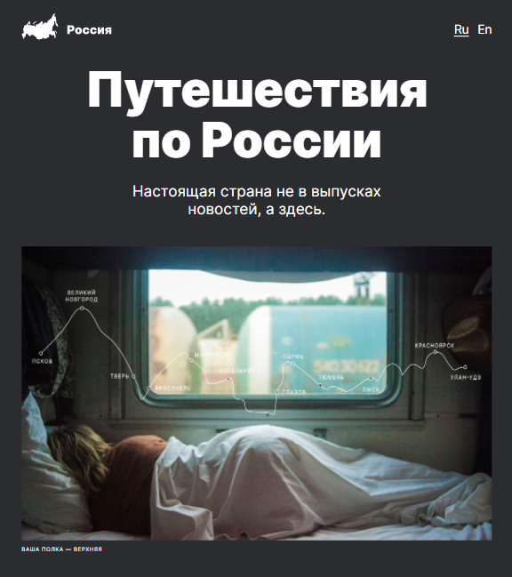

# russian-travel
Проект: Путешествие по России

### Обзор
* Интро
* О чем
* Технологии проекта
* Впечатления
* Ссылка на работу

------------

# Привет!

**Интро**

Меня зовут Лиза, а проект, который я сверстала в качестве итоговой работы третьего спринта, зовется "Путешествия по России". 

**О чем**

Я очень люблю Россию за то, что она такая невероятная красотка! И это именно то, что в чем я в очередной раз убедилась, работая над проектом. В нем собрано множество фотографий одних из самых невероятных мест страны, а также несколько карточек-рекомендаций куда можно отправиться, когда в жизни не хватает красоты.

**Технологии проекта**

Верстая работу, я задействовала известные мне правила разметки и свойств html и css, стараясь не создавать лишних оберток, использовать заголовки различных уровней, иметь ввиду различные группы пользователей при построении структуры страницы. Для оформления большинства блоков задействовала css flexbox + css grid для лучшей адаптивности. С помощью медиазапросов определила стили для отдельных брейкпоинтов для более приближенного к макету результата. Файлы структурированы по БЭМ nested.

**Впечатления**

Если честно, было тяжело. Мне понадобилось очень много времени, чтобы сделать первый шаг в адаптиве, но силы и ответ на вопрос "как это сделать?" я искала около 10 часов (буквально сидела 10 часов и думала, читала разные источники, смотрела все до чего дотянулись руки касательно адаптива). На работу потрачено много эмоциональных сил, надеюсь, однажды у меня получится делать такое за часа за полтора, а не 50 часов, как это произошло со мной в этот раз :) 

**Ссылка на работу**

https://lisaquien.github.io/russian-travel/
